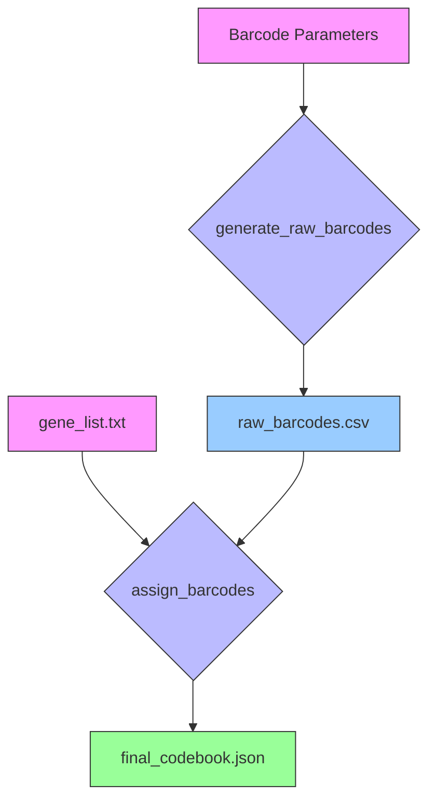

# `CodebookSnakefile`

CodebookSnakefile creates the initial codebook you are working with. 
A codebook is a collection of hamming-spaced codes that are assigned to a set of genes. 

## Workflow 



---

## Configuration (`config.yaml`)

This workflow is controlled by a `config.yaml` file with the following parameters:

| Parameter         | Type    | Description                                                                                             | Example Value                  |
| ----------------- | ------- | ------------------------------------------------------------------------------------------------------- | ------------------------------ |
| `gene_list`       | string  | Path to a text file with one gene/transcript ID per line.                                               | `"config/gene_list.txt"`       |
| `barcode_params`  | object  | A collection of parameters for generating the raw barcodes.                                             |                                |
| `  n_bits`        | integer | Total number of bits in each barcode.                                                                   | `9`                           |
| `  on_bits`       | integer | The number of "on" (i.e., `1`) bits in each barcode.                                                    | `4`                            |
| `  min_dist`      | integer | The minimum Hamming distance between any two barcodes in the set.                                       | `2`                            |
| `assignment_seed` | integer | A random seed used for shuffling the barcodes before assigning them to genes, ensuring reproducibility. | `42`                           |

---
```
gene_list: "config/gene_list.txt"
barcode_params:
  n_bits: 9
  on_bits: 4
  min_dist: 2
assignment_seed: 42
```
## Rules

### 1. `generate_raw_barcodes`

This rule generates the set of raw, error-correcting barcodes.

| Type   | Description                                                                                                        | Path (Example)                                                      | Schema / Format                                                                                              |
| ------ | ------------------------------------------------------------------------------------------------------------------ | ------------------------------------------------------------------- | ------------------------------------------------------------------------------------------------------------ |
| **Output** | A CSV file where each row is a unique barcode and each column is a bit position.                                     | `results/barcodes/n9_on4_dist2.csv`                                | **CSV**: A plain text file where all values are either `0` or `1`, separated by commas. No header is present. |

Ex: 
```
0,1,0,0,1,0,0,0,1
1,1,1,0,1,0,0,0,1
0,1,1,0,1,0,0,0,0
etc...
```

### 2. `assign_barcodes`

This rule takes the gene list and the raw barcodes and creates the final JSON codebook.

| Type   | Description                                                                                                        | Path (Example)                                                      | Schema / Format                                                                                                                                                                                            |
| ------ | ------------------------------------------------------------------------------------------------------------------ | ------------------------------------------------------------------- | ---------------------------------------------------------------------------------------------------------------------------------------------------------------------------------------------------------- |
| **Input**  | A CSV file containing the raw barcodes, generated by the previous rule.                                            | `results/barcodes/n9_on4_dist2.csv`                                | **CSV**: As described above.                                                                                                                                                                               |
| **Input**  | A plain text file with one gene or transcript ID per line.                                                         | `config/gene_list.txt`                                              | **Text**: Standard UTF-8 text file.                                                                                                                                                                        |
| **Output** | The final codebook file, which maps each gene to a specific barcode. This is the main output of this workflow. | `results/codebooks/n20_on4.json`                                    | **JSON**: A single JSON object where keys are the gene/transcript identifiers (string) and values are the assigned barcodes (array of integers `0` or `1`). Includes "Blank-N" keys for any unused barcodes. | 
Ex: 
```
```